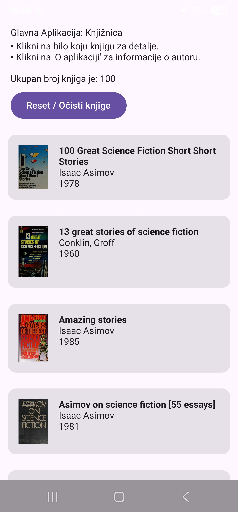

# Book Search App

A modern Android app for searching books via the [Open Library API](https://openlibrary.org/developers/api), built as a hands-on learning project covering the core Android architecture stack: Jetpack Compose, Coroutines/Flow, Hilt, Retrofit, and Room.

## Screenshots

| Loading | Success | Empty | Error |
|:---:|:---:|:---:|:---:|
|  |  |  |  |

## Features

- Search books via the Open Library API
- Book cover images loaded with Coil (with placeholder/error states)
- Offline support: results are cached locally with Room and remain available without an internet connection
- Graceful error handling with a retry action
- Alphabetical sorting of results
- Unit tests covering ViewModel state transitions

## Tech Stack

- **Kotlin** — 100% Kotlin code, written according to modern Kotlin standards and best practices
- **Jetpack Compose** — declarative UI
- **Coroutines & Flow** — asynchronous work and reactive state
- **Hilt** — dependency injection
- **Retrofit + Gson** — networking and JSON parsing
- **Room** — local database, used as the single source of truth
- **Coil** — image loading
- **JUnit + MockK + kotlinx-coroutines-test** — unit testing

## Architecture

```
UI (Compose) → ViewModel → Repository → Retrofit / Room → API / local database
```

The Repository combines a network source (Retrofit) and a local cache (Room) behind a **single source of truth** pattern: the UI only ever reads from Room, while the network's only job is to keep Room up to date. This means the app keeps working — showing the last known results — even without an internet connection.

## Getting Started

1. Clone the repository:
   ```
   git clone https://github.com/ivan17039/android-junior-prep.git
   ```
2. Open the project in Android Studio
3. Let Gradle sync
4. Run the app on an emulator or physical device

No API key is required — the Open Library API is public.

## Learning Journal

This project was built over a structured 4-week self-study plan. Detailed day-by-day notes, including what was learned and self-check answers, live alongside the code:

- [Week 1 – Kotlin basics, first Compose screens, navigation](notes_week1/)
- [Week 2 – ViewModel, Coroutines, StateFlow, Hilt basics](notes_week2/)
- [Week 3 – Retrofit, Repository pattern, Room, Coil, testing](notes_week3/)
- [Week 4 – Architecture review, polish, portfolio prep](notes_week4/)


## What I would add next

- **Real Search Bar:** Allow the user to type a term on the screen themselves (currently the code is fixed to ``science fiction'', as the focus was on getting the architecture, database, and tests together).
- **Load new books while scrolling:** Instead of fetching only the first set of results, automatically pull the next set from the network as soon as the user scrolls near the bottom of the list.
- **Organize folders by functionality:** Organize folders in the project by features instead of by weeks of learning.
- **Dark Mode:** Adjust the appearance of the screen for nighttime use.

## About This Project

Built as a hands-on learning project with the goal of mastering the modern Android architecture — from offline and dependency injection to automated testing. The project covers all the key technologies that are required in advertisements for junior Android developers.