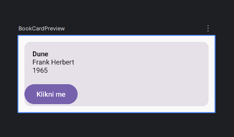
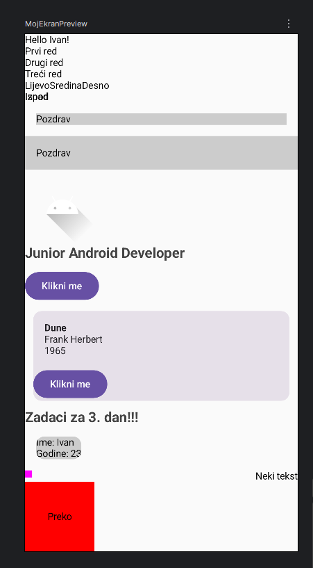

# Dan 3 – Compose ekran (statični UI)

## @Composable

Uvedeno kako ne bi trebali pisati izgled koda ekrana u XML formatu pa povezivat sa Kotlinom (sve u jednome). Ova opcija govori Kotlinu da nešto crta na ekranu mobitela.

```kotlin
@Composable
fun Greeting(name: String) {
    Text(text = "Hello, $name!")
}
```

## @Preview

Omogućava pregled aplikacije odmah u Android Studiju bez potrebe mobitela.

```kotlin
@Preview(showBackground = true)
@Composable
fun GreetingPreview() {
    Greeting("Ivan")
}
```

## Layoutovi: Column, Row, Box

**Column** – slaže elemente okomito

```kotlin
@Composable
fun ExampleColumn() {
    Column {
        Text("Prvi red")
        Text("Drugi red")
        Text("Treci red")
    }
}
```

**Row** – slaže vodoravno jedan pored drugoga

```kotlin
@Composable
fun ExampleRow() {
    Row {
        Text("Lijevo")
        Text("Sredina")
        Text("Desno")
    }
}
```

// Column i Row imaju parametre za raspored i poravnanje (vertical,horizontalArrangement i _Alignment)

**Box** – preklapa elemente jedne preko drugih (z-stack)

```kotlin
@Composable
fun ExampleBox() {
    Box {
        Text("Ispod")
        Text("Iznad")   // renderira se preko prethodnog
    }
}
```

## Modifier – način kojem Composable-u dodajemo ponašanje i izgled

```kotlin
Text(
    text = "Pozdrav",
    modifier = Modifier
        .padding(16.dp)
        .fillMaxWidth()
        .background(Color.LightGray)
)
```

- `.padding(16.dp)` — razmak oko elementa
- `.fillMaxWidth()` / `.fillMaxSize()` — zauzmi svu dostupnu širinu/veličinu
- `.size(100.dp)` — fiksna veličina
- `.background(Color.White)` — boja pozadine
- `.clip(RoundedCornerShape(8.dp))` — zaobljeni rubovi (obično prije `.background()`)
- `.clickable { /* akcija */ }` — čini element klikabilnim

## Text, Image, Button elementi u Composable

```kotlin
Text(
    text = "Junior Android Developer",
    fontSize = 20.sp,
    fontWeight = FontWeight.Bold,
    color = Color.DarkGray
)
```

- `sp` = za tekst isključivo
- `dp` = za veličine elemenata, margine, padding // jednako veliko i na malom i ogromnom ekranu
- `contentDescription` = za accessibility, osobe oštećenog vida (TalkBack)
- `painter = painterResource(id = R.drawable.moja_slika)`
    - `painter` — parametar za prikaz slike
    - `painterResource` — funkcija koja prevodi sliku u željeni oblik na ekranu
    - `R.drawable.moja_slika` — adresa slike (R – kartica sa svim resursima, drawable – mapa)

```kotlin
Image(
    painter = painterResource(id = R.drawable.ic_launcher_foreground),
    contentDescription = "Opis slike za screen reader" // bitno za accessibility!
)

Icon(
    imageVector = Icons.Default.Search,
    contentDescription = "Pretraživanje"
)

Button(onClick = { /* akcija kasnije */ }) {
    Text("Klikni me")
}
```
---

## Zadaci za 3. dan – riješeno u projektu

```kotlin
package com.ivanb.jobprepapp

import android.os.Bundle
import androidx.activity.ComponentActivity
import androidx.activity.compose.setContent
import androidx.activity.enableEdgeToEdge
import androidx.compose.foundation.Image
import androidx.compose.foundation.layout.fillMaxSize
import androidx.compose.foundation.layout.padding
import androidx.compose.material3.Scaffold
import androidx.compose.material3.Text
import androidx.compose.runtime.Composable
import androidx.compose.ui.Modifier
import androidx.compose.ui.tooling.preview.Preview
import com.ivanb.jobprepapp.ui.theme.JobPrepAppTheme
import androidx.compose.foundation.layout.Column
import androidx.compose.foundation.layout.Row
import androidx.compose.foundation.layout.Box
import androidx.compose.ui.graphics.Color
import androidx.compose.foundation.background
import androidx.compose.foundation.layout.Arrangement
import androidx.compose.foundation.layout.fillMaxWidth
import androidx.compose.foundation.layout.size
import androidx.compose.foundation.shape.RoundedCornerShape
import androidx.compose.material3.Button
import androidx.compose.material3.Icon
import androidx.compose.ui.Alignment
import androidx.compose.ui.draw.clip
import androidx.compose.ui.res.painterResource
import androidx.compose.ui.text.font.FontWeight
import androidx.compose.ui.unit.sp
import androidx.compose.ui.unit.dp

class MainActivity : ComponentActivity() {
    override fun onCreate(savedInstanceState: Bundle?) {
        super.onCreate(savedInstanceState)
        enableEdgeToEdge()
        setContent {
            MojEkran("Ivan")
        }
    }
}

@Composable
fun MojEkran(name: String, modifier: Modifier = Modifier) {
    Column(modifier = modifier){
        Text(
            text = "Hello $name!",
            modifier = modifier
        )
        ExampleColumn()
        ExampleRow()
        ExampleBox()

        Text(
            text = "Pozdrav",
            modifier = Modifier
                .padding(16.dp)
                .fillMaxWidth()
                .background(Color.LightGray)
        )
        // Bitan je redoslijed
        Text(
            text = "Pozdrav",
            modifier = Modifier
                .background(Color.LightGray)
                .padding(16.dp)
                .fillMaxWidth()

        )
        // 1. Slika (koristi zadanu Android ikonu)
        Image(
            painter = painterResource(id = R.drawable.ic_launcher_foreground),
            contentDescription = "Profilna slika"
        )

        // 2. Tekst
        Text(
            text = "Junior Android Developer",
            fontSize = 20.sp,
            fontWeight = FontWeight.Bold,
            color = Color.DarkGray
        )

        // 3. Gumb
        Button(
            onClick = { /* Ovdje pišemo logiku kad netko klikne */ },
            modifier = Modifier.padding(top = 12.dp)
        ) {
            Text("Klikni me")
        }
        BookCard(book = sampleBooks[0])

        Text(
            text="Zadaci za 3. dan!!!",
            fontSize = 20.sp,
            fontWeight = FontWeight.Bold,
            color = Color.DarkGray
        )
        PersonCard("Ivan", 23)
        RowArrangment()
        BoxElement()
    }

}

@Composable
fun ExampleColumn() {
    Column {
        Text( text = "Prvi red")
        Text( text = "Drugi red")
        Text( text = "Treći red")
    }
}

@Composable
fun ExampleRow() {
    Row {
        Text("Lijevo")
        Text("Sredina")
        Text("Desno")
    }
}

@Composable
fun ExampleBox() {
    Box {
        Text("Ispod")
        Text("Iznad")   // renderira se preko prethodnog
    }
}

@Composable
fun PersonCard(name: String, age: Int){
    Column(
        modifier = Modifier
            .padding(all = 16.dp)
            .clip(RoundedCornerShape(12.dp))
            .background(Color.LightGray)
    ){
        Text("Ime: $name")
        Text("Godine: $age")
    }
}

@Composable
fun RowArrangment(){
    Row(
        modifier = Modifier.fillMaxWidth(),
        horizontalArrangement = Arrangement.SpaceBetween
    ){
        Box(
            modifier = Modifier
                .size(10.dp)
                .background(Color.Magenta)
        )
        Text(text = "Neki tekst")
    }

}

@Composable
fun BoxElement(){
    Box (
        modifier = Modifier.size(100.dp) .background(Color.Red)
    ) {
        Text(text = "Preko", modifier = Modifier.align(Alignment.Center))
    }
}

@Preview(showBackground = true)
@Composable
fun MojEkranPreview() {
    MojEkran("Ivan")
}
```
## Screenshotovi





