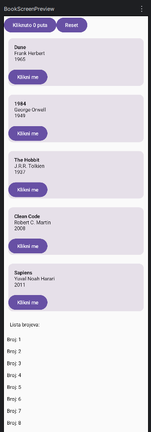

---

# LazyColumn, remember, state

**state** - vrijednost koja se može promijeniti i na koju UI reagira.

```kotlin
// Problem Composable funkcija je taj da se svaki put ponovno pozove, 
// stoga ovaj kod ispisuje "Kliknuto 0 puta" iako se klik registrira svaki put:
@Composable
fun Counter() {
    var count = 0   // obična varijabla

    Button(onClick = { count++ }) {
        Text("Kliknuto $count puta")
    }
}

```

### remember + mutableStateOf

Rješenje ovog problema je spremanje vrijednosti izvan obične varijable, u posebnu Compose memoriju koja ne nestaje kad se funkcija ponovno pozove:

```kotlin
var count = remember { mutableStateOf(0) }

Button(onClick = { count.value++ }) {
    Text("Kliknuto ${count.value} puta")
}

```

* **`mutableStateOf(0)`** - spremnik kod kojeg Compose može primijetiti kad se vrijednost unutra promijeni.
* **`remember { ... }`** - omogućava Composeu da zapamti prvobitni spremnik te da ne stvara nove.

```kotlin
var count by remember { mutableStateOf(0) } // count bez .value

// Za korištenje 'by' trebaju se dodati importi:
// import androidx.compose.runtime.getValue
// import androidx.compose.runtime.setValue

```

---

* **Recomposition** - ponovni poziv funkcije za prikaz novih rezultata.
* **LazyColumn** - stvara samo elemente trenutno vidljive na ekranu plus par dodatnih za skrolanje (stari koji nestaju s ekrana odbacuju se iz memorije, a novi se dodaju).

```kotlin
LazyColumn {
    items(sampleBooks) { mojaKnjiga -> 
        BookCard(book = mojaKnjiga)
    }
}

```

* **`LazyColumn { }`** - slaže elemente okomito isto kao `Column`, ali "lijeno".
* **`items(sampleBooks)`** - posebna funkcija dostupna samo unutar `LazyColumn` bloka; prima listu `sampleBooks` i govori: *"Za svaki element unutar ove liste izvrši sljedeći kod."*
* **`{ mojaKnjiga -> BookCard(book = mojaKnjiga) }`** - izvrši se za svaki element posebno; uzme trenutni `book` iz liste, šalje ga `BookCard` funkciji koja ga ispisuje na ekranu.

---

## Zadaci

### 1. i 2. SimpleCounter()

```kotlin
@Composable
fun SimpleCounter() {
    var count by remember { mutableStateOf(0) }
    
    Button(onClick = { count++ }) {
        Text("Kliknuto $count puta")
    }
    Button(onClick = { count = 0 }) {
        Text("Reset")
    }
}

```

### 3. i 4. LazyColumn()

```kotlin
@Composable
fun BookScreen(books: List<Book>, modifier: Modifier = Modifier) {
    var count by remember { mutableStateOf(0) }

    LazyColumn(modifier = modifier) {

        item {
            Row {
                Button(onClick = { count++ }) {
                    Text("Kliknuto $count puta")
                }
                Button(onClick = { count = 0 }) {
                    Text("Reset")
                }
            }
        }

        items(books) { book ->
            BookCard(book = book)
        }

        item {
            Text(
                text = "Lista brojeva:",
                modifier = Modifier.padding(16.dp)
            )
        }

        items((1..50).toList()) { number ->
            Text(
                text = "Broj: $number",
                modifier = Modifier.padding(8.dp)
            )
        }
    }
}

```

### 5. Zašto je Column s for petljom loš izbor za 5.000 elemenata?

Zbog toga što `Column` odmah stvara i ispisuje sve vrijednosti unutar liste `sampleBooks` u memoriju, stoga je to loš izbor za razliku od `LazyColumn`-a koji stvara samo trenutno vidljive vrijednosti na ekranu i ažurira ih kako se ekran skrola.

---

## Screenshotovi

