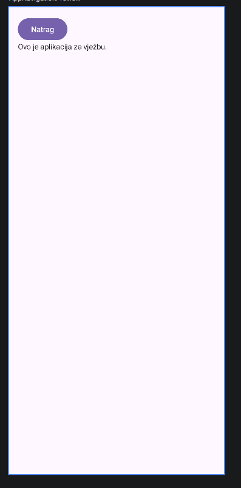
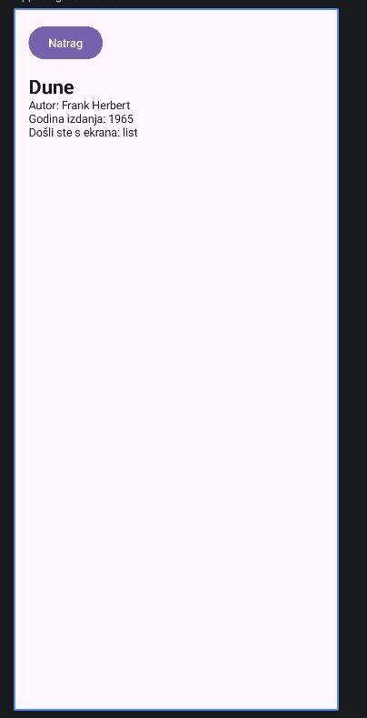
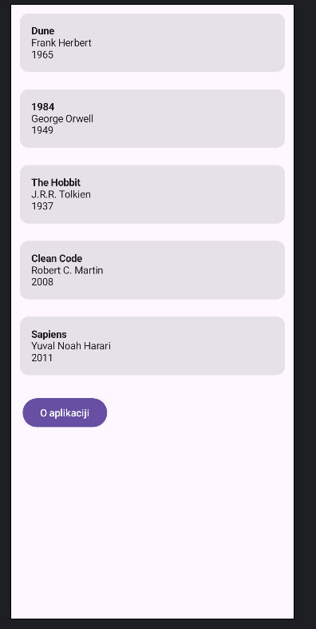

# Dan 5 – Navigacija između ekrana

// trenutno sa MainActivity prikaze se samo 1 composable

## Navigation Compose

Mehanizam koji omogućuje koji composable trenutno prikazati, pamti prethodni radi back opcije.

## NavController, NavHost, ruta

**NavController** – objekt koji izdaje naredbe za navigaciju prema ekranima

```kotlin
val navController = rememberNavController()
navController.navigate("nesto")
```

**NavHost** – composable koji prikazuje trenutni ekran koji je na NavController-u

**Ruta (route)** – string koji identificira svaki ekran (npr. "book_list", "book_detail")

**Back stack** – stog (stack) posjećenih ruta, novi ekran se na svaki `navigate()` postavlja u stack, a s `popBackStack()` skida za back mogućnosti

## Osnovni skeleton

```kotlin
import androidx.navigation.compose.NavHost
import androidx.navigation.compose.composable
import androidx.navigation.compose.rememberNavController

@Composable
fun AppNavigation() {
    val navController = rememberNavController()

    NavHost(navController = navController, startDestination = "screen_a") {
        composable("screen_a") {
            Text("Ovo je ekran A")
        }
        composable("screen_b") {
            Text("Ovo je ekran B")
        }
    }
}
```

- `startDestination = "screen_a"` – koja se ruta prikaže pri pokretanju aplikacije
- `composable("screen_a") {...}` – kad je trenutna ruta 'screen_a', prikaži to unutar zagrada

## Prosljeđivanje argumenata

```kotlin
composable("book_detail/{bookIndex}") { backStackEntry ->

    // izvlacenje teksta iz route i pretvaranje u Int kako bi se pronasla odredjena knjiga
    val index = backStackEntry.arguments?.getString("bookIndex")?.toIntOrNull() ?: 0
    // koristi index
}

// Kad se sitsne na knjigu s indexom nekim pozove se:
navController.navigate("book_detail/$index")
```

`backStackEntry` – svaki put kad NavHost prikaže neki ekran, dobije se objekt sa informacijama o tom pozivu, uključujući argumente iz rute.

```
navController.navigate("book_detail/2") -> slozi string "book_detail/2" -> s backStackEntry izvucemo "2" -> val knjiga = sampleBooks[2] dohvacanje knjige natrag
```

---

## Zadaci 1–3

### AboutScreen.kt

```kotlin
package com.ivanb.jobprepapp

import androidx.compose.foundation.layout.Column
import androidx.compose.foundation.layout.padding
import androidx.compose.material3.Button
import androidx.compose.material3.Text
import androidx.compose.runtime.Composable
import androidx.compose.ui.Modifier
import androidx.compose.ui.unit.dp

@Composable
fun AboutScreen(onBack: ()->Unit, modifier: Modifier=Modifier){

    Column(modifier=modifier.padding(16.dp)){
        Button(onClick = onBack){
            Text("Natrag")
        }
        Text("Ovo je aplikacija za vježbu.")
    }

}
```

### AppNavigation.kt

```kotlin
package com.ivanb.jobprepapp

import androidx.compose.foundation.layout.fillMaxSize
import androidx.compose.foundation.layout.padding
import androidx.compose.material3.Scaffold
import androidx.compose.material3.Text
import androidx.compose.runtime.Composable
import androidx.compose.ui.Modifier
import androidx.compose.ui.tooling.preview.Preview
import androidx.navigation.compose.NavHost
import androidx.navigation.compose.composable
import androidx.navigation.compose.rememberNavController

@Composable
fun AppNavigation() {
    // stvara se upravitelj navigacije, pamti na kojem smo ekranu
    val navController = rememberNavController()

    // Scaffold uveden kako dio ekrana ne bi isao preko sata i datuma
    Scaffold(modifier = Modifier.fillMaxSize()) { innerPadding ->
        NavHost(
            navController = navController,
            startDestination = "book_list",
            modifier = Modifier.padding(innerPadding)
        ) {
            composable("book_list") {
                BookListScreen(
                    books = sampleBooks,
                    onBookClick = { book ->
                        val index = sampleBooks.indexOf(book)
                        navController.navigate("book_detail/$index/list")
                    },
                    onAboutClick = {
                        navController.navigate("about")
                    }
                )
            }
            composable("book_detail/{bookIndex}/{fromScreen}") { backStackEntry ->
                val index = backStackEntry.arguments?.getString("bookIndex")?.toIntOrNull() ?: 0
                val fromScreen = backStackEntry.arguments?.getString("fromScreen") ?: "unknown"
                BookDetailScreen(
                    book = sampleBooks[index],
                    onBack = { navController.popBackStack() },
                    fromScreen = fromScreen,
                )
            }
            composable(route="about"){
                AboutScreen(
                    onBack = {navController.popBackStack()}
                )
            }
        }
    }
}

@Preview(showBackground = true)
@Composable
fun AppNavigationPreview() {
    AppNavigation()
}
```


*`BookListScreen.kt` i `BookDetailScreen.kt` također ažurirani da prime `onAboutClick` odnosno `fromScreen` parametar*

### BookListScreen.kt
```kotlin
package com.ivanb.jobprepapp

import androidx.compose.foundation.layout.padding
import androidx.compose.foundation.lazy.LazyColumn
import androidx.compose.foundation.lazy.items
import androidx.compose.material3.Button
import androidx.compose.material3.Text
import androidx.compose.runtime.Composable
import androidx.compose.ui.Modifier
import androidx.compose.ui.unit.dp

@Composable
fun BookListScreen(
    books: List<Book>,
    onBookClick: (Book) -> Unit,
    modifier: Modifier = Modifier,
    onAboutClick: () -> Unit
) {
    LazyColumn(modifier = modifier) {
        items(books) { book ->
            BookCard(book = book, onClick = { onBookClick(book) })
        }
        item{
            Button(onClick = onAboutClick, modifier= Modifier.padding(16.dp)){
                Text("O aplikaciji")
            }
        }
    }
}
```

### BookDetailScreen.kt
```kotlin

package com.ivanb.jobprepapp

import androidx.compose.foundation.layout.Column
import androidx.compose.foundation.layout.Spacer
import androidx.compose.foundation.layout.height
import androidx.compose.foundation.layout.padding
import androidx.compose.material3.Button
import androidx.compose.material3.Text
import androidx.compose.runtime.Composable
import androidx.compose.ui.Modifier
import androidx.compose.ui.text.font.FontWeight
import androidx.compose.ui.unit.dp
import androidx.compose.ui.unit.sp

@Composable
fun BookDetailScreen(
    book: Book,
    onBack: () -> Unit,
    fromScreen: String,
    modifier: Modifier = Modifier
) {
    Column(modifier = modifier.padding(16.dp)) {
        Button(onClick = onBack) {
            Text("Natrag")
        }
        Spacer(modifier = Modifier.height(16.dp))
        Text(text = book.title, fontSize = 24.sp, fontWeight = FontWeight.Bold)
        Text(text = "Autor: ${book.author}")
        Text(text = "Godina izdanja: ${book.year}")

        Text(
            text = "Došli ste s ekrana: $fromScreen"
        )
    }
}

```

## Zadatak 4

**Pitanje:** Što bi se dogodilo (koji problemi) da si pokušao ručno serijalizirati cijeli `Book` objekt u JSON string i proslijediti ga kroz rutu umjesto indeksa?

**Odgovor:** Svaka promjena unutar Book objekta mogla bi pokvariti rutu.

---

## Screenshotovi



