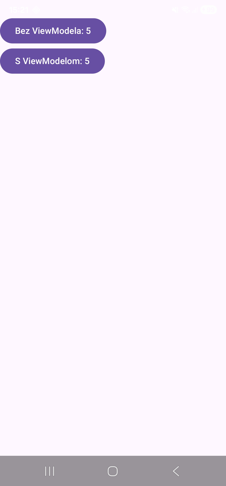
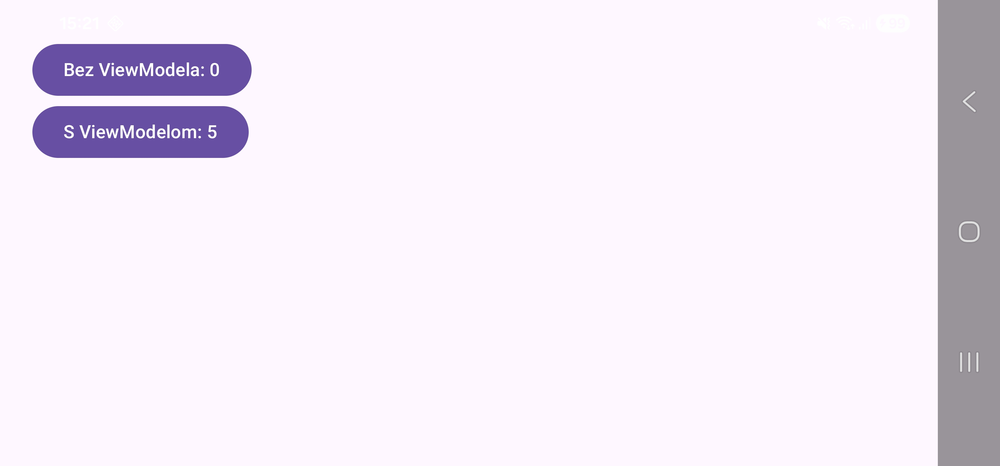
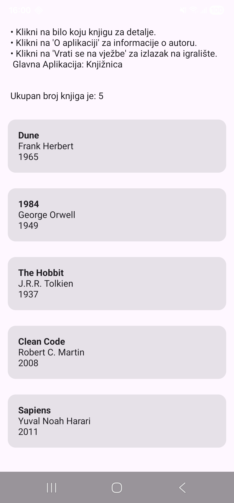
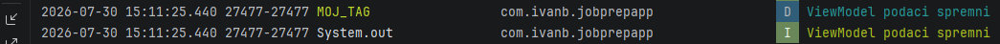

# Tjedan 2, Dan 2 – ViewModel i viewModelScope

## Teorija

ViewModel - klasa dizajnirana za promjene konfiguracije (rotacija) kako bi se sačuvale vrijednosti na ekranu

Android Framework čuva objekt ViewModelStore (cjelina koja prezivljava rotaciju) i tako nakon rotacije kad se zatrazi ViewModel Framework prvo provjeri postojeću instancu u ViewModelStore-u kako bi vratio postojeću i ne stvarao novu.

Kad ekran stvarno nestane (korisnik izadje iz aplikacije) Framework poziva onCleared() na ViewModel-u koji stvarno unisti Activity.

viewModelScope - Coroutine scope koji se automatski otkaze kad se ViewModel ocisti (zivotni vijek coroutine i ViewModel-a povezan kako nebi doslo do nepotrebnog trosenja resursa)

```kotlin
class BookListViewModel : ViewModel() {
    init {
        viewModelScope.launch {
            delay(500) // simulacija dohvaćanja
            // ...
        }
    }
}
```

## Dokaz rotacije

Prije rotacije (oba brojača klikana do 5):



Nakon rotacije ekrana:



"Bez ViewModela" se resetirao na 0, "S ViewModelom" ostao na 5.

## Zadatak 1 – ukupan broj knjiga
Dodaj computed property `val bookCount: Int get() = books.size` u `BookListViewModel`, prikaži ukupan broj knjiga kao `Text` iznad liste u `BookListScreen`.



## Zadatak 2 - ViewModel Lifecycle i `init` blok
U `BookListViewModel`, dodaj `init { }` blok koji pokrene `viewModelScope.launch { delay(500); println("ViewModel podaci spremni") }`. 
Pokreni app, rotiraj ekran nekoliko puta — provjeri u Logcatu/konzoli da se ispis dogodi samo jednom (kod prvog stvaranja ViewModela), ne kod svake rotacije. To dokazuje da init blok (i time coroutine unutra) radi samo jednom po "životu" ViewModela, ne po svakoj recompoziciji ili rotaciji.



```kotlin
// BookListViewModel
class BookListViewModel : ViewModel() {
    val books: List<Book> = sampleBooks
    val bookCount: Int get() = books.size

    init {
        viewModelScope.launch {
            delay(500)
            Log.d("MOJ_TAG", "ViewModel podaci spremni")
            println("ViewModel podaci spremni")
        }
    }
}

// ...........

//BookListScreen.kt
item{
    Text(text = "Ukupan broj knjiga je: ${viewModel.bookCount}", modifier = Modifier
        .fillMaxWidth()
        .padding(16.dp))

}
items(viewModel.books) { book ->
    BookCard(book = book, onClick = { onBookClick(book) })
}
```