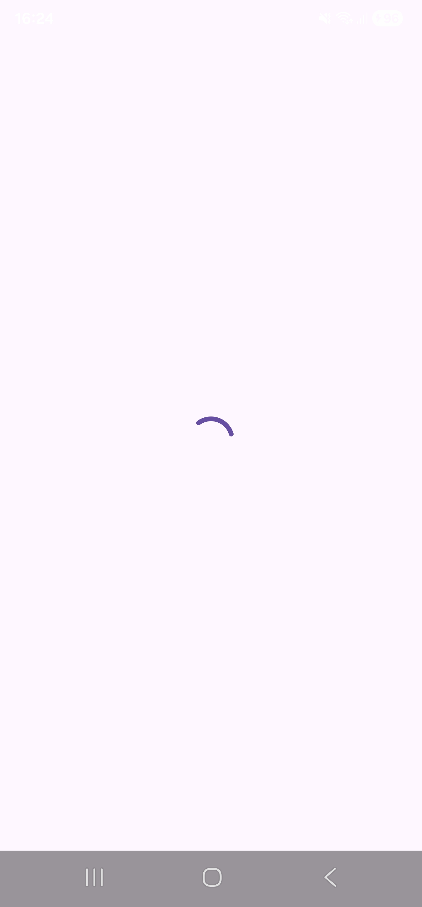
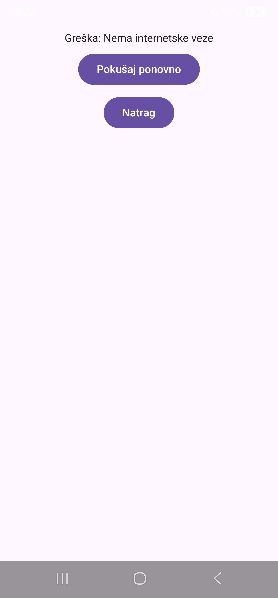
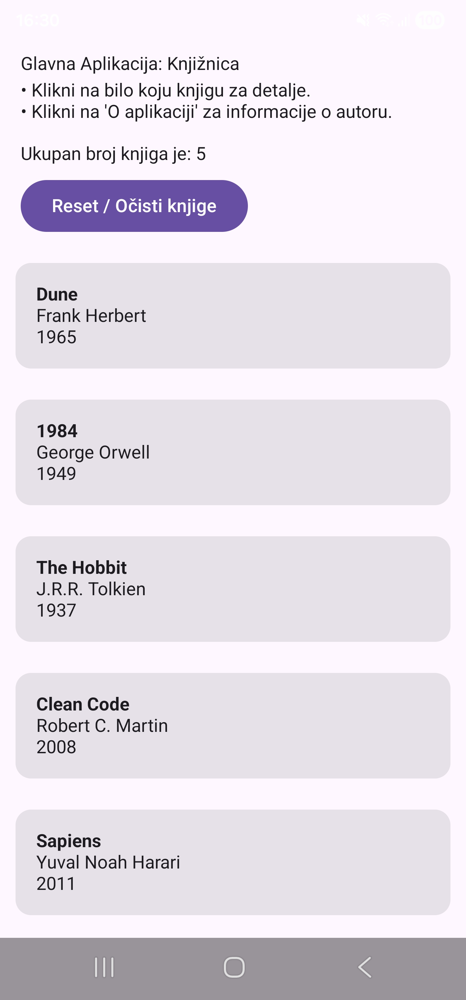

Evo gotovog primjera s relacijskim putanjama (kakve se najčešće koriste u Markdownu unutar projekta, npr. ako slike spremaš u mapu `screenshots/` ili u isti direktorij s bilješkama):

```markdown
# UiState Pattern u Praksi (Tjedan 2, Dan 4)

## Zašto UiState (Loading / Success / Error)?

Prazna lista je dvosmislena za UI jer može biti da:
* Podaci se još učitavaju
* Podaci su stvarno prazni
* Dogodila se greška

UiState donosi takve asinkrone podatke jasno na bilo koji ekran.

---

## Definiranje i Povezivanje sa StateFlow-om

```kotlin
sealed class UiState {
    object Loading : UiState()
    data class Success(val data: List<Book>) : UiState()
    data class Error(val message: String) : UiState()
}

```

Umjesto `StateFlow<List<Book>>`, ViewModel sada izlaže `StateFlow<UiState>` i točno zna u kojoj je fazi:

```kotlin
class BookListViewModel : ViewModel() {
    private val _uiState = MutableStateFlow<UiState>(UiState.Loading)
    val uiState: StateFlow<UiState> = _uiState.asStateFlow()

    // Kako bi UI od prve sekunde znao točno u kojem je stanju
    init {
        loadBooks()
    }

    fun loadBooks() {
        viewModelScope.launch {
            _uiState.value = UiState.Loading
            delay(1000) // simulacija mrežnog poziva
            _uiState.value = UiState.Success(sampleBooks)
        }
    }
}

```

---

## `when` Grananje u Compose-u

```kotlin
val state by viewModel.uiState.collectAsState()

when (val currentState = state) {
    is UiState.Loading -> {
        // spinner
    }
    is UiState.Success -> {
        // currentState.data je ovdje dostupan, pametno "smart-cast"-an
    }
    is UiState.Error -> {
        // currentState.message je ovdje dostupan
    }
}

```

---

## Vježbe i Zadaci

### 1. Dokaži exhaustive `when` uživo

Privremeno maknuta grana `is UiState.Error -> { ... }` iz `when` bloka u `BookListScreen`.

**Rezultat / Greška kompajlera:**

> `'when' expression must be exhaustive. Add the 'is Error' branch or an 'else' branch.`

---

### 2. Konkretnija poruka greške i screenshotovi

Promijenjena poruka greške na realističniju ("Nema internetske veze").

#### Screenshot – Loading Stanje



#### Screenshot – Error Stanje ("Nema internetske veze")



#### Screenshot – Success Stanje


