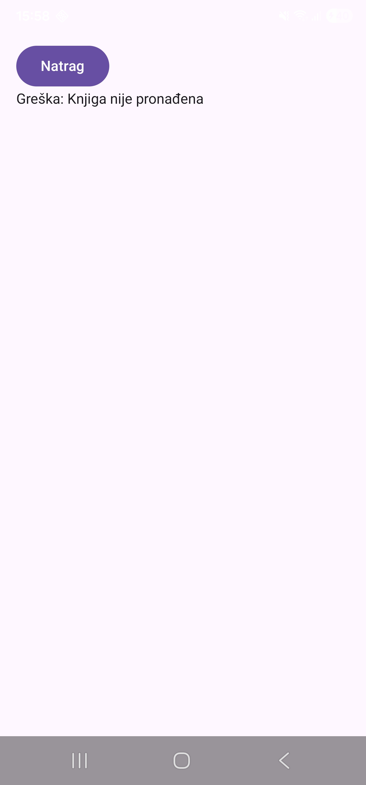

# Tjedan 2, Dan 5 – Navigation Compose s argumentima

## Suradnja Navigation Compose-a i ViewModel-a

Svaki ekran ima svoj ViewModel — prirodno se uklapa u to kako Navigation Compose već upravlja životnim vijekom

Tako sad svaki put kad se klikne na neku knjigu i otvori novi ekran, Navigation Compose dodijeli privatni ViewModel samo za taj ulazak u sobu

## SavedStateHandle

SavedStateHandle - nacin na koji ViewModel sam cita index rute i proslijedi kao parametar dalje

```kotlin
class BookDetailViewModel(
    savedStateHandle: SavedStateHandle
) : ViewModel() {
    private val bookIndex: Int = savedStateHandle.get<String>("bookIndex")?.toIntOrNull() ?: 0
    // ...
}
```

Priprema za hiltViewModel() - automatski ima sve ovisnosti koje ViewModel treba bez da rucno stvara

---

## Zadatak 1 – testiranje Error grane

Testiraj Error granu — privremeno u book_list-ovom onBookClick promijeni indeks koji se šalje u rutu na nešto izvan raspona (npr. `navController.navigate("book_detail/99/list")` umjesto stvarnog indeksa), pokreni, provjeri da se ispravno prikaže "Knjiga nije pronađena" umjesto crasha. Vrati kod natrag nakon testiranja.

Nakon postavke `navController.navigate("book_detail/99/list")` ekran prikazuje:



## Zadatak 2 (stretch) – `fromScreen` u ViewModel preko SavedStateHandle

Isti obrazac kao za `bookIndex`, samo za `fromScreen`. Promjene po fajlu:

**`BookDetailViewModel.kt`** — dodaj `fromScreen` u `Success` stanje, pročitaj ga iz `SavedStateHandle`-a:

```kotlin
sealed class BookDetailUiState {
    object Loading : BookDetailUiState()
    data class Success(
        val book: Book,
        val fromScreen: String // novo
    ) : BookDetailUiState()
    data class Error(val message: String) : BookDetailUiState()
}

class BookDetailViewModel(
    savedStateHandle: SavedStateHandle
) : ViewModel() {
    private val bookIndex: Int = savedStateHandle.get<String>("bookIndex")?.toIntOrNull() ?: 0
    private val fromScreen: String = savedStateHandle.get<String>("fromScreen") ?: "Nepoznato" // novo

    // ... u init bloku, zadnja linija se mijenja u:
    _uiState.value = if (book != null) {
        BookDetailUiState.Success(book = book, fromScreen = fromScreen)
    } else {
        BookDetailUiState.Error("Knjiga nije pronađena")
    }
}
```

**`BookDetailScreen.kt`** — makni `fromScreen` parametar iz funkcije, čitaj ga iz stanja umjesto:

```kotlin
@Composable
fun BookDetailScreen(
    viewModel: BookDetailViewModel = viewModel(),
    onBack: () -> Unit,
    // fromScreen parametar maknut odavde
    modifier: Modifier = Modifier
) {
    // ...
    is BookDetailUiState.Success -> {
        // ...
        Text(text = "Došli ste s ekrana: ${currentState.fromScreen}") // umjesto $fromScreen
    }
}
```

**`AppNavigation.kt`** — poziv postaje jednostavniji, `backStackEntry` više ne treba:

```kotlin
composable("book_detail/{bookIndex}/{fromScreen}") {
    BookDetailScreen(
        onBack = { navController.popBackStack() }
    )
}
```

Rezultat: `BookDetailScreen` više uopće ne zna za rute ni argumente — samo prikazuje ono što mu `BookDetailUiState` da.

---

## Provjera

**1. Zašto je dobra praksa da svaki ekran ima svoj ViewModel, umjesto jednog velikog "God ViewModel-a" za cijelu app?**

Zbog pravila jedna odgovornost po klasi i zbog toga sto svaki ekran ima drugaciji vijek trajanja stoga bi God ViewModel trebao pratiti svaki ekran sto zahtjeva vise resursa u testiranjima.