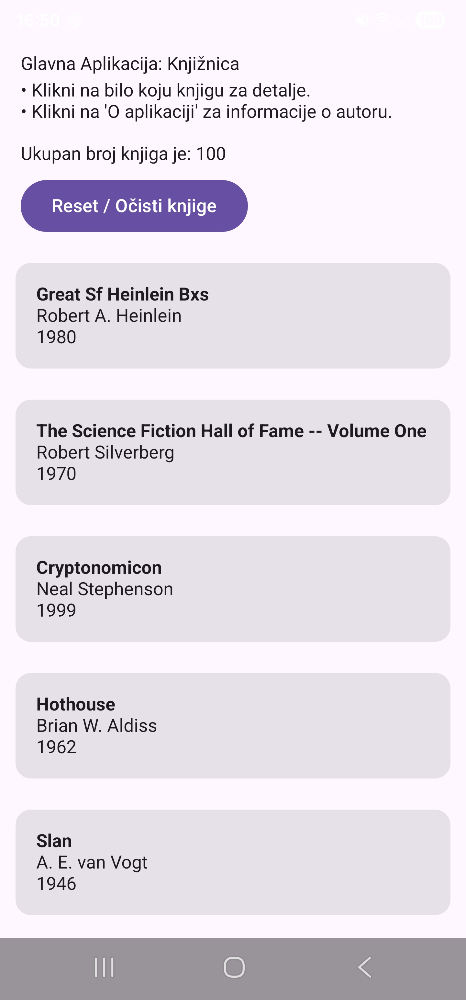
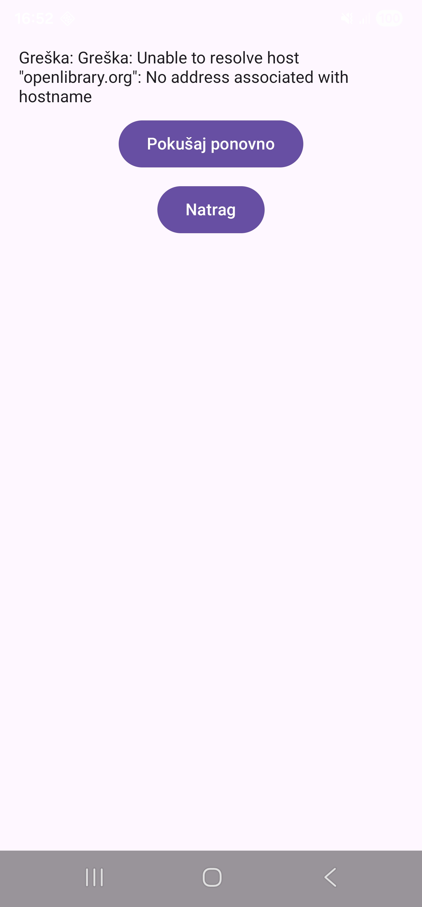

---

# Bilješke i Zadaci

## Suspend lanac po slojevima

Funkcija na dnu lanca poziva mrežni poziv, stoga se `suspend` mora prenijeti sve do ViewModela:

* **`ApiService.searchBooks()`** $\rightarrow$ `suspend` (Retrofit mrežni poziv)
* **`BookRepository.searchBooks()`** $\rightarrow$ `suspend` (zbog poziva `apiService.searchBooks()`)
* **`ViewModel`** $\rightarrow$ Nije `suspend`, ali pokreće korutinu preko `viewModelScope.launch { }` za poziv `suspend` funkcije iz Repositoryja

---

## Extension funkcija `.toBook()`

Extension funkcija `.toBook()` omogućuje da se na svakom DTO objektu može pozvati `dto.toBook()` i dobiti spreman `Book` model.

```kotlin
private fun OpenLibraryBookDto.toBook(): Book {
    return Book(
        title = title,
        author = authorName?.firstOrNull() ?: "Nepoznat autor",
        year = firstPublishYear ?: 0
    )
}

```

Ovo stoji u **`BookRepository`**-ju jer Repository uzme sirove DTO podatke s mreže, očisti ih s `.toBook()` i ViewModelu proslijedi samo čisto pripremljene `Book` objekte.

---

## Zadaci
1.**Promjena pretrage:** Promijeni `"fantasy"` u neki drugi upit (npr. `"science fiction"` ili ime tvog omiljenog autora) — pokreni i provjeri da se prikažu drugačiji rezultati. 

2.**Testiranje Loading stanja:** Usporen internet (ili isključivanje pa uključivanje Wi-Fi/mobilnih podataka dok se app pokreće) prirodno produži Loading fazu — provjeri da spinner ostane vidljiv dulje.
3.**Testiranje Error stanja:** Isključi internet prije pokretanja aplikacije i pokreni je — trebao bi se vidjeti Error stanje s porukom (zahvaljujući `try/catch` bloku). Ovo je uvod u ono što se detaljnije obrađuje 6. dana.
