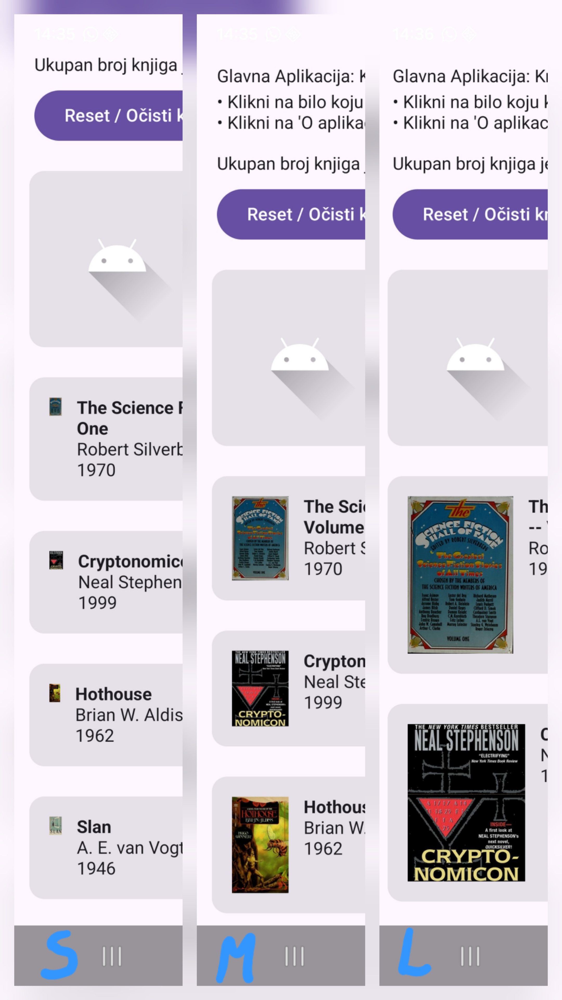
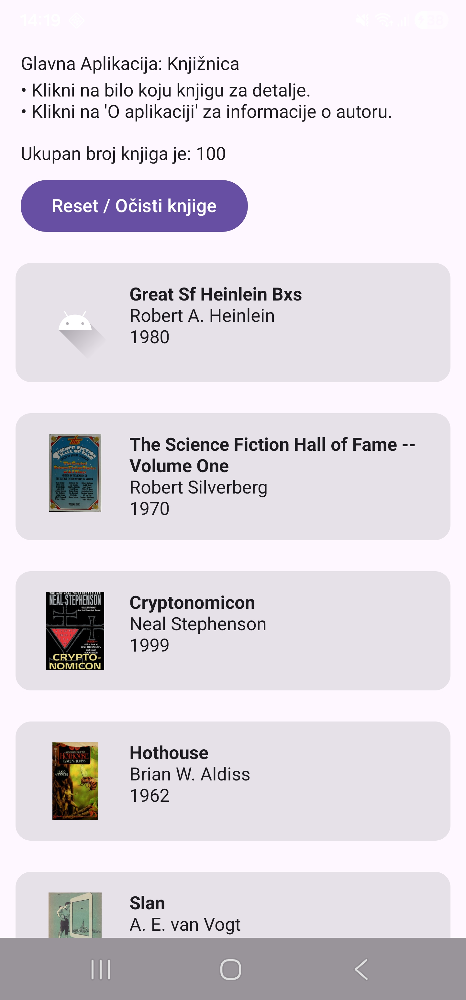

# Bilješke i Zadaci – Coil (Coroutine Image Loader)

## Problem ručnog učitavanja slika

Za ručno učitavanje slika potreban je niz operacija:

* Otvoriti mrežnu vezu
* Preuzeti sirove bajtove, dekodirati ih u `Bitmap` pa tek onda prikazati
* Pobrinuti se za memoriju, keshiranje (spremanje slike kad se skrola natrag), otkazivanje (prikaz elemenata na ekranu rješiv s `LazyColumn`) i greške

**Rješenje** je uvesti **Coil** (Coroutine Image Loader) koji radi sve ove operacije umjesto vas te je izgrađen direktno na poznatim korutinama.

---

## Coil osnove: `AsyncImage`, `placeholder`, `error`

```kotlin
AsyncImage(
    model = book.coverUrl, // što učitati (URL string)
    contentDescription = book.title, // accessibility (pomoć slijepim i slabovidnim osobama)
    placeholder = painterResource(R.drawable.ic_launcher_foreground), // prikaz dok se slika učitava
    error = painterResource(R.drawable.ic_launcher_foreground), // ako učitavanje ne uspije (loš URL, nema interneta)
    modifier = Modifier.size(60.dp)
)

```

---

## Poseban servis za slike korica

```text
https://covers.openlibrary.org/b/id/{COVER_ID}-{SIZE}.jpg

```

* **`{SIZE}`**: jedno od `S`, `M` ili `L`
* **Primjer:** `[https://covers.openlibrary.org/b/id/12547191-M.jpg](https://covers.openlibrary.org/b/id/12547191-M.jpg)`

---

## Zadaci

1. **Testiranje veličina slika (-M vs -L vs -S):**
   Promijeni `-M.jpg` u `-L.jpg` u URL-u, pokreni i usporedi vizualnu razliku veličine/kvalitete slike.



2. **Testiranje knjige bez `coverId`:**
   Pronađi (ili privremeno simuliraj) knjigu bez `coverId` — provjeri da se error slika prikaže umjesto rušenja aplikacije (crasha) ili praznog prostora.

Kao što se može vidjeti na slici, prva knjiga nema `coverId` (odnosno vraćen je `null`) te je prikazana rezervna `placeholder`/`error` ikona.



3. **Razmišljanje – Otkazivanje preuzimanja u `LazyColumn`-u:**
   Zašto je otkazivanje preuzimanja slike posebno bitno baš kod `LazyColumn`-a, a manje bitno ako imaš samo jednu sliku na cijelom ekranu?
* **Odgovor:** Zbog toga što `LazyColumn` koristimo kod učitavanja više stavki, pri čemu prilikom skrolanja prošli elementi izlaze s ekrana i uništavaju se. Otkazivanje mrežnog poziva u tom trenutku spriječava nepotrebno trošenje mrežnog prometa (bandwidtha) i baterije na slike koje korisnik više ne vidi. Kod jedne statične slike na ekranu taj mrežni promet nije toliko kritičan jer se slika učitava samo jednom i ostaje vidljiva.


---