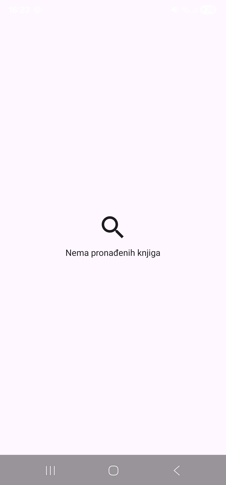

**Empty state** - aplikacija radi ispravno, samo trenutno nema što prikazati.

Ujednačavanje spacing-a umjesto `8.dp`/`16.dp` $\rightarrow$ `Spacing.medium` / `Spacing.small`:

```kotlin
object Spacing {
    val small = 8.dp
    val medium = 16.dp
    val large = 24.dp
}

```

**Zadatak 1.** Testiraj empty state uživo — privremeno promijeni upit u ViewModelu na nešto što sigurno neće vratiti rezultate (npr. `"asdkfjaslkdjf123"`), pokreni, provjeri da se prikaže tvoj novi empty state umjesto praznog ekrana. Vrati upit natrag.



---

**Zadatak 2.** Razmisli (bez koda): zašto ne možeš jednostavno uvijek prikazivati empty-state izgled dok se podaci učitavaju, umjesto posebnog Loading spinnera? Koja je konceptualna razlika između "još ne znam ima li podataka" i "znam da ih nema"?

Zbog toga što je to krivi prikaz korisniku odnosno izvještaj što se događa s njegovim zahtjevom za podatke.
Ne zna je li app još u tijeku, je li nešto slomljeno, ili je pretraga stvarno vratila nula rezultata.
Eksplicitan empty state (ikona + poruka) jasno izvještava da "app radi ispravno, samo trenutno nema što prikazati". S tom ikonom i porukom korisnik zna da nema podataka.